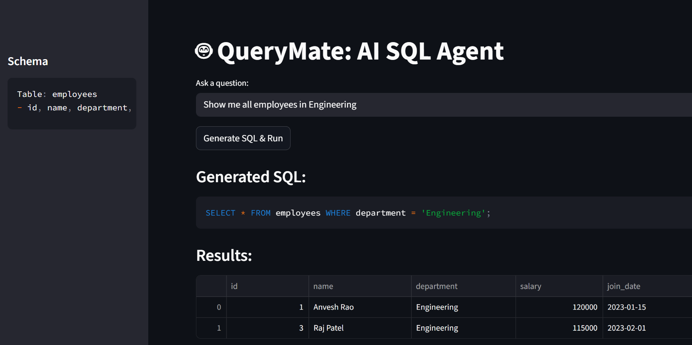

# QueryMate: Natural Language to SQL Agent 🤖

QueryMate is a Streamlit-based AI agent that converts natural language questions into executable SQL queries. It allows non-technical users to interact with relational databases without writing code.

### 📸 Demo

### 🛠️ Tech Stack
* **Frontend:** Streamlit
* **Database:** SQLite (Demo), PostgreSQL (Production ready)
* **Language:** Python 3.10+
* **Logic:** NLP-based Text-to-SQL translation

### 🚀 How to Run
1. `pip install -r requirements.txt`
2. `streamlit run app.py`
